# Stacks

- Uses Blake3 for hashing (via @noble/hashes).
- Uses nacl (TweetNaCl) for public-key cryptography.
- Uses UDP sockets for networking (via Bun's udp sockets).

```mermaid
sequenceDiagram
    autonumber
    participant A as Shelter Client (Alice)
    participant N as Network (UDP Broadcast)
    participant B as Shelter Client (Bob)

    Note over A: Knows Bob's Public Key Hash
    A->>N: SEEK (Type 0x03, targetIdHash)

    Note over B: Receives Broadcast
    B->>B: Compare targetIdHash with local ID

    rect rgb(30, 30, 40)
    Note right of B: Match Found
    B->>A: SEEK_BACK (Type 0x04, targetIdHash) [Unicast]
    end

    Note over A: Receives SEEK_BACK
    A->>A: Maps IP/Port to Bob's ID

    A->>B: MESSAGE (Type 0x02, Encrypted Payload)
    Note right of B: Decrypts using NaCl.box
```



# Try

## From Source, With Bun

- Cloning the repo:

```bash
git clone https://github.com/anthromeda/shelter.git
cd shelter
```

Install Bun (if not already installed):

```bash
# Linux / macOS
$ curl -fsSL https://bun.sh/install | bash

# Windows (via PowerShell)
$ powershell -c "irm bun.sh/install.ps1 | iex"
```

- Install dependencies:

```bash
bun install
```

```bash
bun run ./apps/shelter-daemon.ts
```

- In another terminal, run the CLI:

```bash
bun run ./apps/shelter-cli.ts help
```

## Standalone Daemon & CLI

Pre-built binaries are available in the [Releases](https://github.com/anthromeda/shelter/releases)

# Features

- Secure by default: only the packet receiver can decrypt the data.
- Peer-to-peer: no central servers required.
- Low latency: built on top of UDP for fast data transmission.

# Roadmap

- [x] Working Networking Prototype (to send data between two peers or broadcast)
- [x] Encryption & Decryption of messages
- [x] Peer Discovery (SEEK / SEEK_BACK)
- [ ] Local Petname System

# CLI Documentation

## Commands

_Work in progress..._

# Contributing

We welcome contributions! Whether it's fixing bugs, adding documentation, or proposing new features.

## How to Contribute

1. **Fork the Repository**: standard GitHub workflow.
2. **Create a Feature Branch**: git checkout -b feature/NewThing.
3. **Code Guidelines**:
   - Follow the existing code base.
   - Add new tests for your feature in tests/.

4. **Submit a Pull Request**: Describe your changes clearly.
