_Note : This project is in early development. Some API features can change before stable release.
Also, the project is open to contributions and suggestions. Feel free to open issues or pull requests!_

# Stacks

- Uses Blake3 for hashing (via @noble/hashes).
- Uses nacl (TweetNaCl) for public-key cryptography.
- Uses UDP sockets for networking (via Bun's udp sockets).

```mermaid
sequenceDiagram
    autonumber
    participant A as Shelter Client (Alice)
    participant N as Network (UDP Broadcast)
    participant B as Shelter Client (Bob)

    Note over A: Knows Bob's Public Key Hash
    A->>N: SEEK (Type 0x03, targetIdHash)

    Note over B: Receives Broadcast
    B->>B: Compare targetIdHash with local ID

    rect rgb(30, 30, 40)
    Note right of B: Match Found
    B->>A: SEEK_BACK (Type 0x04, targetIdHash) [Unicast]
    end

    Note over A: Receives SEEK_BACK
    A->>A: Maps IP/Port to Bob's ID

    A->>B: MESSAGE (Type 0x02, Encrypted Payload)
    Note right of B: Decrypts using NaCl.box
```



# Try

- Cloning the repo:

```bash
git clone https://github.com/anthromeda/shelter.git
cd shelter
```

Install Bun (if not already installed):

```bash
curl -fsSL https://bun.sh/install | bash
```

- Install dependencies:

```bash
bun install
```

- Run the example app:

```bash
bun run ./app/main.ts
```

# Features

- Secure by default: only the packet receiver can decrypt the data.
- Peer-to-peer: no central servers required.
- Low latency: built on top of UDP for fast data transmission.
- High-level language bridges.
- Support to co-exist with the existing internet infrastructure (HTTP/S, WebSockets, etc.).

# The Promises

- **Shelter** isn't hosted, you host it.
- **Shelter** isn't owned, you own it.
- **Shelter** isn't monitored, you are private.
- **Shelter** isn't centralized, you are in control.

# Roadmap

- [x] Core Protocol Design
- [x] Working Networking Prototype (to send data between two peers or broadcast)
- [ ] Make it reliable and fast (retransmissions, ordering, etc.)
- [x] Encryption & Decryption of messages
- [x] Peer Discovery (SEEK / SEEK_BACK)
- [ ] Local Petname System
- [ ] Translate code into Rust, Haxe or Zen-C (when possible)
- [ ] Reporting Bad Actors
- [ ] Profile System: a public key for each profile, but linked to the parent public key.
- [ ] High-level Language Bridges (JavaScript, Python, Rust, Go, etc.)
- [ ] Documentation & Tutorials

# Contributing

We welcome contributions! Whether it's fixing bugs, adding documentation, or proposing new features.

## How to Contribute

1. **Fork the Repository**: standard GitHub workflow.
2. **Create a Feature Branch**: git checkout -b feature/NewThing.
3. **Code Guidelines**:
   - Follow the existing code base.
   - Add new tests for your feature in tests/.

4. **Submit a Pull Request**: Describe your changes clearly.
